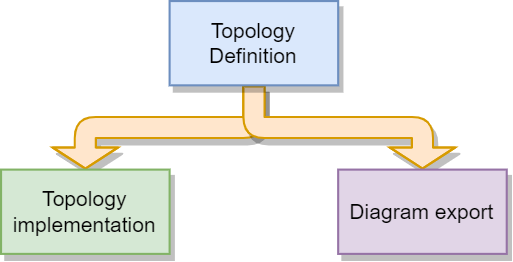
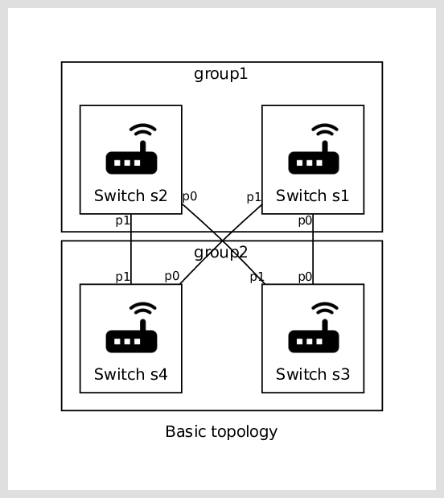

===========================
Pyxnet: SDN testing library
===========================

:Authors: - Florian Dupeyron <florian.dupeyron@mugcat.fr>
:Date: December 2022

Introduction
============

`Pyxnet` is a python (py) library targetted at creating virtual networks (net) using SDN [#]_ technology. The `x` in the
name is for the crossover thing.
Its main application is for testing software behaviour in a given environment, or external devices
like embedded devices. This tool is structured in such a way that it is simple to integrate in
automated test environments, and that created network topologies are easy to export in
documentation.

  
  Pyxnet goals

.. [#] Software Defined Networking

.. `pyxnet` is the contraction of `py` for python, `net` for network, and a `x` for the crossover. It is a simple
.. python library somehow like `mininet`_, but more targetted towards embedded devices testing. It makes extensive
.. use of the `iproute2` linux utility suite, and `openvswitch`_.
.. 
.. .. _`mininet`: http://mininet.org
.. .. _`openvswitch`: https://www.openvswitch.org/
.. 
.. This library allows to create virtual network topologies, for instance assign specific MAC or IP addresses,
.. and instanciate this topology on a linux host, or generate a diagram of this toplogy using `graphviz`.

Installation
============

You can install this package via :code:`pip`:

.. code:: bash

  pip install git+https://github.com/fdmysterious/pyxnet

Dependencies
============

This library depends on the following elements:

- Linux only
- `openvswitch`_ must be installed, and the following commands must be available:

  - `ovs-vsctl`
  - `ovs-dpctl`
  - `ovs-ofctl`

- iproute interface is made using the `pyroute2`_ library.
- `graphviz`_ allows graph generation

.. _`openvswitch`: https://www.openvswitch.org/
.. _`pyroute2`: https://pyroute2.org/
.. _`graphviz`: https://github.com/xflr6/graphviz

Defining a network topology
===========================

General principles
------------------

A network topology is defined using the following elements:

- Topology objects
- Links between objects' endpoints

For instance, Let's take the following topology:

  Example topology

Toplogy objects are the four switches :code:`s1`, :code:`s2`, :code:`s3` and :code:`s4`, each switch have two endpoints
:code:`p0` and :code:`p1`, and links are symbolized by the lines on the graph.

The python code generating this topology is fairly straightforward:

.. code:: python

  if __name__ == "__main__":
    logging.basicConfig(level=logging.INFO)

    # First, declare a topology object. This object will holds all objects declaration,
    # as well as links between these objects.
    tt = Topology(name="Basic topology")

    # Secondly, we declare the objects we will have in our topology.
    s1 = tt.register(MyCustomSwitch("s1", mac_addr="02:01:02:00:00:01", ip_addr="10.0.0.1/24"), group="group1")
    s2 = tt.register(MyCustomSwitch("s2", mac_addr="02:01:02:00:00:02", ip_addr="10.0.0.2/24"), group="group1")
    s3 = tt.register(MyCustomSwitch("s3", mac_addr="02:01:02:00:00:03", ip_addr="10.0.0.3/24"), group="group2")
    s4 = tt.register(MyCustomSwitch("s4", mac_addr="02:01:02:00:00:04", ip_addr="10.0.0.4/24"), group="group2")

    # Then, we connect these objects together
    tt.connect(s1.p0, s3.p0)
    tt.connect(s1.p1, s4.p0)
    tt.connect(s2.p0, s3.p1)
    tt.connect(s2.p1, s4.p1)

    # Then, we can export our graph
    dot = tt.export_graphviz()
    dot.render("output_graph")

    # Now, onto instanciation of our topology!
    cleanup_all()    # Precaution
    tt.instanciate() # Topology instanciation on host platform

    # Up objects
    s1.up()
    s2.up()
    s3.up()
    s4.up()

This example is available in the :code:`examples/basic_topology.py` file. We can see here that after the topology object
is created, the topology is defined by registering objects into our topology, then linking them together. Objects can
be grouped in logical groups for easier representation.

Endpoint types
--------------

Each toplogy object defines endpoints, which are the points that can be linked together in order to define how objects
are linked together. This corresponds for instance to a switch's port. Each endpoint can have the following type:

- :code:`Virtual`: the endpoint exists in the virtual world, *e.g.* inside the host machine;
- :code:`Real`: the endpoint exists in the real world, *e.g.* outside the host machine;
- :code:`Phy`: the endpoint is an interface on the host machine, *e.g.* a usb/phy dongle, or a port on an ethernet card.

This type definition imples the following statements:

- All the network topology can be defined, virtual and real objects;
- A virtual endpoint cannot be linked directly to a real endpoint. **There must be** a phy interface in between.

As defined, the user doesn't have to worry about implementation details, and what object neeeds to be defined or not,
wether it have to be instanciated in the linux machine or not. This also makes the generated graph exhaustive about
the tested topology.

Defining a custom object
------------------------

Defining a custom object is straightforward, as it is class based. Here is an example of how to define a custom switch with two ports:

.. code:: python

  class MyCustomSwitch(Switch):
      """
      This class illustrates how a custom network object can be created
      by simply inheriting base objects
      """

      def __init__(self, name: str, mac_addr: str = None, ip_addr: str = None):
          # Each topology object has a name
          super().__init__(name,
              mac_addr   = mac_addr, # Not mandatory
              ip_addr    = ip_addr,  # Not mandatory

              stp_config = {
                  "rstp_enabled": True,     # Enable RSTP!
                  "bridge_priority": 0x8000 # Set bridge priority
              }
          )

          # Init endpoints
          self.p0 = self._endpoint_register("p0", Endpoint_Kind.Virtual)
          self.p1 = self._endpoint_register("p1", Endpoint_Kind.Virtual)

          # Set endpoint RSTP properties
          self.p0.properties["stp_config"] = {
              "path_cost": 100,
              "priority":  0x8000,
          }

          self.p1.properties["stp_config"] = {
              "path_cost": 100,
              "priority": 0x8000,
          }

      def export_graphviz(self, dot):
          """
          Illustrate how it's possible to customize
          the diagram generated object
          """

        dghelpers.box_logo_node(dot, self.name, dghelpers.asset("icons/material/router.png"), f"Switch {self.name}")

What we can see here, is that the important elements are:

- Each network object has an unique name ;
- the :code:`export_graphviz()` method exports the object on a graphviz diagram. The `google material icon set`_ is included in this package. 

.. _`google material icon set`: https://github.com/google/material-design-icons 

To define a network object from scratch, you can derive the :code:`PyxNetObject` class. The following methods can be defined:

- :code:`instanciate(self)`: Implements how the object is instanciated on the linux platform;
- :code:`remove(self)`: Implements how the object is removed from the linux platform;
- :code:`up(self)`: Implements how the object is bring up on the the linux platform;
- :code:`down(self)`: Implements how the object is bring down on the linux platform;
- :code:`export_graphviz(self, dot)`: Implements how the object is represented on a graphviz diagram.

.. TODO: What is going under the hood when instanciating the topology on a linux machine.

License
=======

MIT License

Copyright (c) 2023 Florian Dupeyron <florian.dupeyron@mugcat.fr>

Permission is hereby granted, free of charge, to any person obtaining a copy
of this software and associated documentation files (the "Software"), to deal
in the Software without restriction, including without limitation the rights
to use, copy, modify, merge, publish, distribute, sublicense, and/or sell
copies of the Software, and to permit persons to whom the Software is
furnished to do so, subject to the following conditions:

The above copyright notice and this permission notice shall be included in all
copies or substantial portions of the Software.

THE SOFTWARE IS PROVIDED "AS IS", WITHOUT WARRANTY OF ANY KIND, EXPRESS OR
IMPLIED, INCLUDING BUT NOT LIMITED TO THE WARRANTIES OF MERCHANTABILITY,
FITNESS FOR A PARTICULAR PURPOSE AND NONINFRINGEMENT. IN NO EVENT SHALL THE
AUTHORS OR COPYRIGHT HOLDERS BE LIABLE FOR ANY CLAIM, DAMAGES OR OTHER
LIABILITY, WHETHER IN AN ACTION OF CONTRACT, TORT OR OTHERWISE, ARISING FROM,
OUT OF OR IN CONNECTION WITH THE SOFTWARE OR THE USE OR OTHER DEALINGS IN THE
SOFTWARE.
